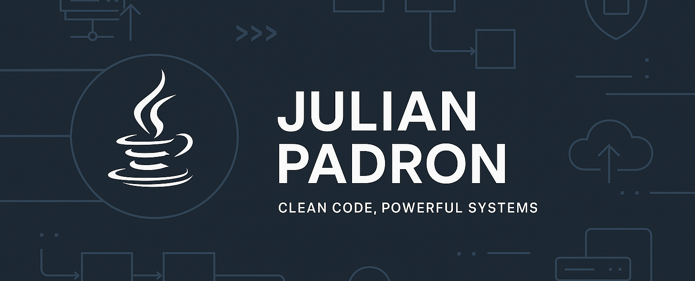

# 👋 Hey, I'm Julian!

🎓 **Software Engineer** | Computer Science Graduate from **The University of Texas Rio Grande Valley**  
🚀 **Backend Developer** specialized in building scalable systems and integrating AI solutions. 

 *"Passionate about architecting robust backends and bridging enterprise logic with Artificial Intelligence."*

---

## 💻 Tech Stack

- **Languages**: Java (Strong), Python, SQL, JavaScript, Ruby  
- **Frameworks**: Spring Boot 3, Spring Security, Hibernate/JPA, Ruby on Rails 8  
- **Tools & Platforms**: Git, Docker, Maven, Postman, Linux, MongoDB, PostgreSQL  
- **Testing**: JUnit 5, Mockito, Cucumber, RSpec
---

## 🚀 Featured Project

### 🤖 [AI-Powered Recommendation Engine]([https://github.com/your-repo-link](https://github.com/juliannp253/Movies-Recommender))
An AI-driven backend that orchestrates the execution of Python-based AI agents within a Java environment.
- **Tech Stack**: Java, Spring Boot, Python, OpenAI (GPT-5), MongoDB.
- **Key Feature**: Hybrid execution model bridging enterprise Java with dynamic AI scripting.

### 📝 Blog Platform — Ruby on Rails  
A full-stack blog application with:
- User authentication & profile editing  
- Post creation, commenting system  
- User search functionality  
- Database management with ActiveRecord  
- Deployed via Render 

### 🔐 [Java Authentication API]([https://github.com/your-repo-link](https://github.com/juliannp253/auth-service-java))
A production-ready RESTful API focused on secure session management and stateless architecture.
- **Tech Stack**: Spring Boot 3, Spring Security 6, JWT, MySQL.
- **Key Feature**: Implemented Role-Based Access Control (RBAC) and TDD with high test coverage. 

🔗 [View Project on GitHub](https://github.com/juliannp253/Project_Blog) *

---

## 📫 Let's Connect

📧 julian.padronnunez03@gmail.com  
🔗 [LinkedIn](https://www.linkedin.com/in/julian-padron-72669227a)
[Portafolio](https://juliannp253.github.io/portafolio-web/)

