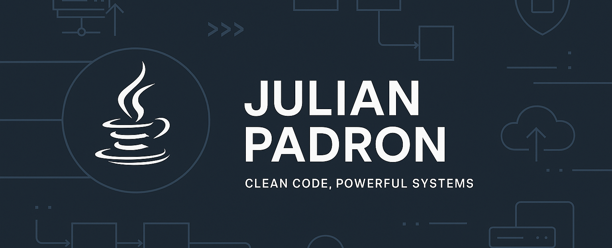

# 👋 Hey, I'm Julian!

🎓 **Software Engineer** | Computer Science Graduate from **The University of Texas Rio Grande Valley**  
🚀 **Backend Developer** Focused on building secure, scalable, and maintainable systems using Java, Spring Boot, and Python. 

 *"Passionate about architecting robust backends and bridging enterprise logic with Artificial Intelligence."*

---

## 💻 Tech Stack

- **Languages**: Java (17/21), C#, SQL (PostgreSQL/MySQL), Python, JavaScript, HTML/CSS  
- **Frameworks**: Spring Boot 3, ASP.NET, React 19, Vite, Spring Security 6, Spring Data JPA, Hibernate  
- **Tools & Platforms**: GitHub Actions (Automated Deployment Pipelines), Docker (Multi-stage Builds & Container Orchestration), Maven, Git, Postman, Render, Azure DevOps  
- **Testing**: JUnit 5, Mockito, Cucumber, RSpec
---

## 🚀 Featured Project

### 🤖 [AI-Powered Recommendation Engine]([https://github.com/your-repo-link](https://github.com/juliannp253/Movies-Recommender))
An AI-driven backend that orchestrates the execution of Python-based AI agents within a Java environment.
- **Tech Stack**: Java, Spring Boot, Python, OpenAI (GPT-5), MongoDB.
- **Key Feature**: Hybrid execution model bridging enterprise Java with dynamic AI scripting.

### ⏯️ [Retro Spotify Web Player](https://retroplayer-front.onrender.com/)
A music web player, with a retro look, that uses the Spotify Api to get user's music
- **Tech Stack**: C#, ASP.NET Core 10.0, React 19, Vite, Docker, OAuth2, Spotify API, Axios, Render
- **Key Feature**: Architected a decoupled full-stack Single Page Application (SPA) using ASP.NET Core 10.0 for a RESTful backend and React 19 with Vite for a highly responsive frontend.

### 🎮 [EduLink](https://edulink-learning-platform-lv0j.onrender.com)
A gamified learning platform developed to enhance English acquisition for students at the Universidad Autónoma del Noroeste (UANE).
- **Tech Stack**: Java 17, Spring Boot 3, Spring Security 6, PostgreSQL (Supabase), Spring Data JPA, Swagger, Thymeleaf
- **Key Feature**: A full-stack learning platform using Java 17 and Spring Boot 3, implementing an extensible domain model through class inheritance and polymorphism to manage diverse pedagogical challenges (Music, Emoji, Match).

### 🔐 [Java Authentication API]([https://github.com/your-repo-link](https://github.com/juliannp253/auth-service-java))
A production-ready RESTful API focused on secure session management and stateless architecture.
- **Tech Stack**: Spring Boot 3, Spring Security 6, JWT, MySQL.
- **Key Feature**: Implemented Role-Based Access Control (RBAC) and TDD with high test coverage. 

---

## 📫 Let's Connect

📧 julian.padronnunez03@gmail.com  
🔗 [LinkedIn](https://www.linkedin.com/in/julian-padron-72669227a)  
[Portafolio](https://juliannp253.github.io/portafolio-web/)

